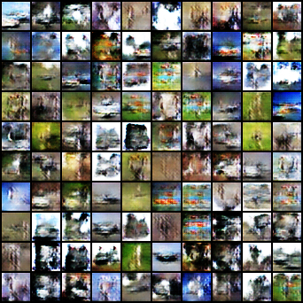
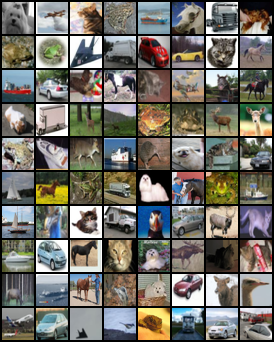
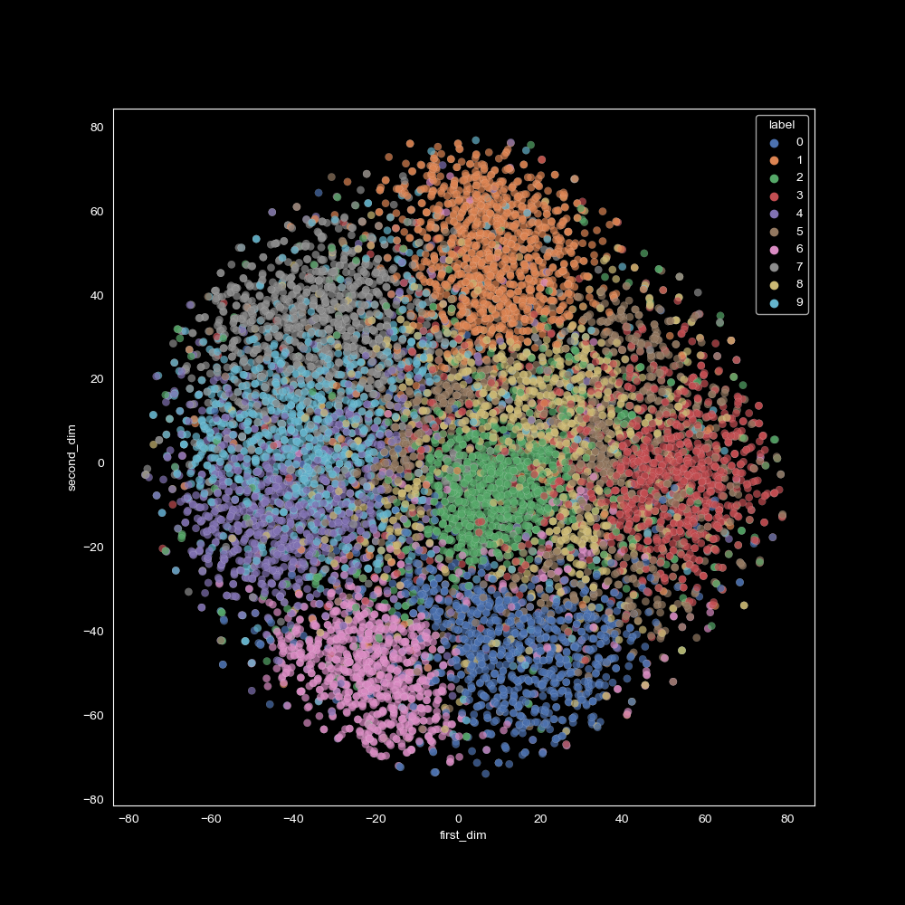

# Implementing custom GAN & VAE models

Implementing and training VAE & DCGAN models from scratch, with functions to analyse their outputs.

Functions for the VAE model:
1. Training the model on the MNIST training set & testing on the test set.
2. Analysing (+ visualising) the effect of different betas on the train & test loss.
3. Comparing original samples, reconstructed samples, and generated samples.
4. Looking at VAE latent representations using T-SNE.

Functions for GAN model:
1. Training a DCGAN on the CIFAR10 training set.
2. Comparing generated images with original images.
3. Visualising generator and discriminator loss over the epochs.

Implementations of the models can be found in the `models.py` file.

## How to run
Install the requirements by running `pip install -r requirements.txt` or `conda install --file requirements.txt`. 

Create a folder called `data` in the root folder. This is where the CIFAR10 and MNIST datasets will be saved.

Run `VAE.py` for training and testing the VAE model. Additional functions and hyperparameters can be specified and 
called in the main function at the bottom of the file.

Run `GAN.py` for training and testing the GAN model. Additional functions and hyperparameters can be specified with 
flags in the main function at the bottom of the file.

If you want to save generated images and models, ensure the folders `saved_models` and `img` also exist in the root 
folder. 

## Examples

^ Images generated by GAN after training for 10 epochs.

^ Real images from CIFAR10 dataset for comparison.

^ Visualisation of latent representations of the VAE model (MNIST dataset).